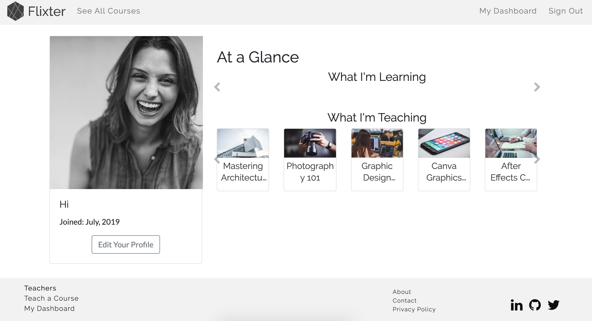

# README

Flixter is a Two Sided Market Place that was built with Ruby on Rails.

You can see a live version here: https://flixter-alex-gergar.herokuapp.com/

 A two-sided, video-streaming marketplace platform that features credit card payment capabilities, user role management, complex user interfaces, and advanced database relationships.

See screenshots below.

